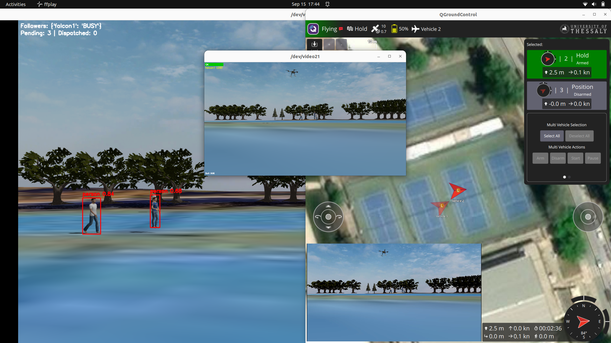
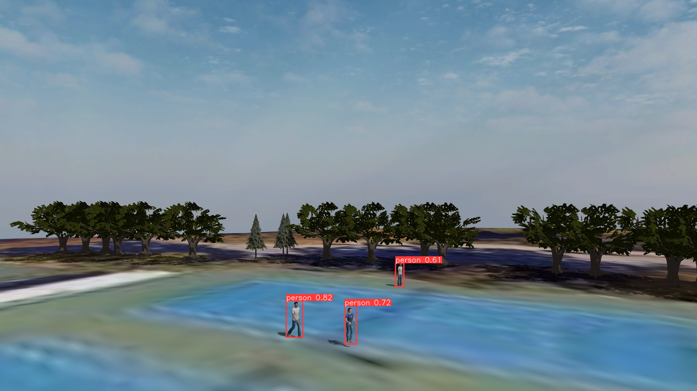
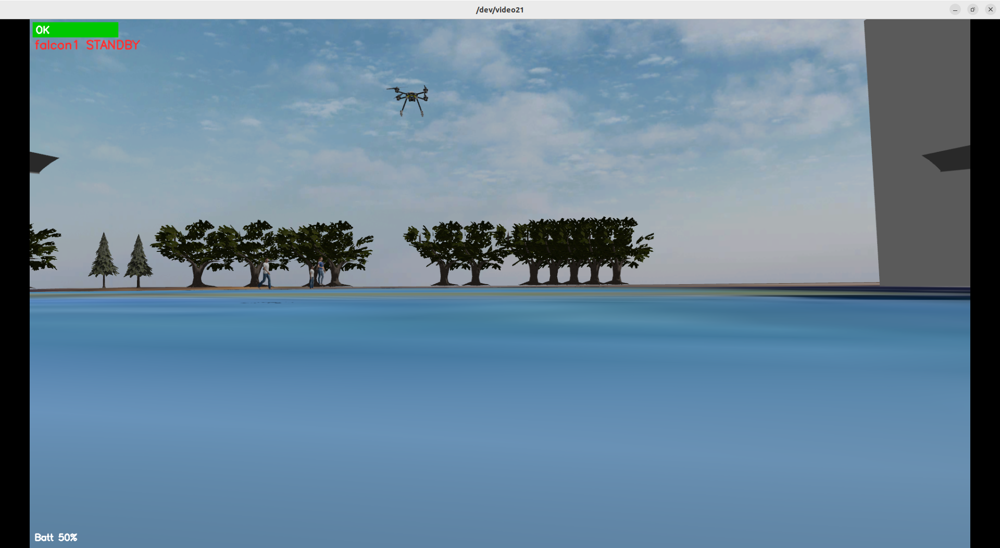
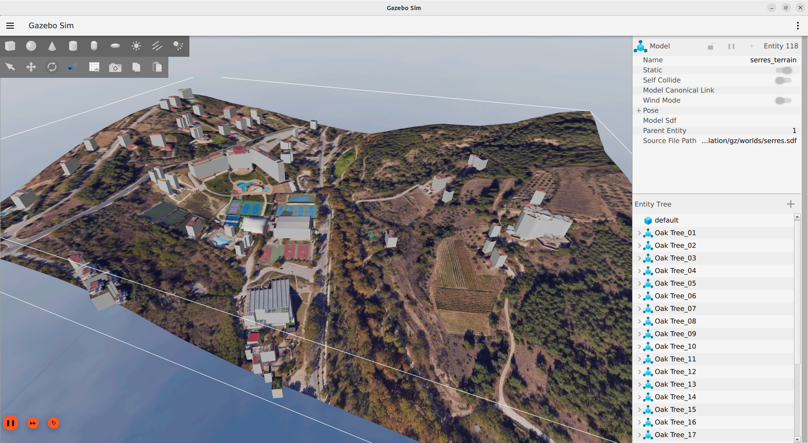
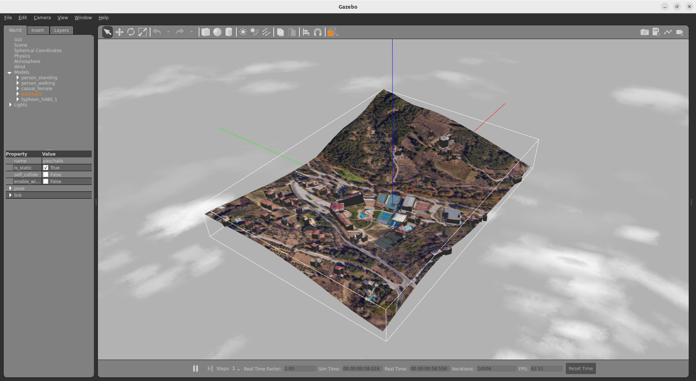

<h1 align="center">SwarmPilot</h1>
<p align="center"><em><small>
Autonomous multi-drone control and perception on ROS 2 + PX4 with edge AI and real-time video.
</small></em></p>




Autonomous multi‑drone control and perception on **ROS 2 + PX4** with edge AI and real‑time video. Runs the same in **SITL**, **HITL**, and on **real UAVs**. A GPU/NPU **leader** detects and assigns targets; **followers** track and fly via Offboard control. Perception runs on‑board; only compact ROS 2 messages and encoded video leave the airframes.

- **Flight:** PX4 + uXRCE‑DDS (native ROS 2)
- **Middleware:** ROS 2 Humble
- **Vision:** YOLOv5 (TensorRT on leader) / RKNN (followers)
- **Video path:** Camera → OpenCV overlay → **v4l2loopback** → external **SRT sender**
- **Sim:** Gazebo Harmonic (via `ros_gz_bridge`)
- **Networking:** Wi‑Fi AP or BATMAN‑adv/Babel mesh

## Quick Start (SITL, 3 UAVs)
**Prereqs (Ubuntu 22.04):**
```bash
sudo apt update
sudo apt install -y python3-opencv gstreamer1.0-tools gstreamer1.0-plugins-{base,good,bad,ugly} \
    v4l2loopback-dkms v4l-utils ffmpeg
```
**Build:**
```bash
cd ~/swarm_ws
rm -rf build/ install/ log/
colcon build --merge-install --cmake-args -DCMAKE_BUILD_TYPE=RelWithDebInfo
source install/setup.bash
```
**QGroundControl:** set `COM_RC_OVERRIDE=1`; optionally map `RC_MAP_OFFB_SW`.

**Agents (3 terms):**
```bash
ROS_DOMAIN_ID=30 MicroXRCEAgent udp4 -p 8888
ROS_DOMAIN_ID=30 MicroXRCEAgent udp4 -p 8889
ROS_DOMAIN_ID=30 MicroXRCEAgent udp4 -p 8890
```
**PX4 (3 terms):**
```bash
# Leader
cd ~/PX4-Autopilot
PX4_UXRCE_DDS_NS=leader PX4_SYS_AUTOSTART=4002 PX4_SIM_MODEL=gz_x500_depth_1 PX4_GZ_WORLD=serres \
  ./build/px4_sitl_default/bin/px4 -i 1

# Follower 1
PX4_UXRCE_DDS_NS=falcon1 PX4_GZ_STANDALONE=1 PX4_SYS_AUTOSTART=4002 PX4_GZ_MODEL_POSE="0,1" \
  PX4_SIM_MODEL=gz_x500_depth_2 PX4_GZ_WORLD=serres ./build/px4_sitl_default/bin/px4 -i 2

# Follower 2
PX4_UXRCE_DDS_NS=falcon2 PX4_GZ_STANDALONE=1 PX4_SYS_AUTOSTART=4002 PX4_GZ_MODEL_POSE="0,2" \
  PX4_SIM_MODEL=gz_x500_depth_3 PX4_GZ_WORLD=serres ./build/px4_sitl_default/bin/px4 -i 3
```
**Loopbacks (1 term):**
```bash
sudo modprobe -r v4l2loopback 2>/dev/null || true
sudo modprobe v4l2loopback devices=3 video_nr=20,21,22 \
  card_label="loopback0,loopback1,loopback2" exclusive_caps=0 \
  max_buffers=2 max_width=1920 max_height=1080
```
## Run (one‑liner)
```bash
CFG="$(ros2 pkg prefix --share uav_swarm_ros2)/config/swarm_sitl.yaml"
ROS_DOMAIN_ID=30 ros2 launch uav_swarm_ros2 swarm.launch.py config:="$CFG"
```

**Streaming (SRT ports):** Leader **8888**, F1 **8891**, F2 **8892**.


## Gallery
**Leader overlay (streamed):**


**Follower overlays (streamed):**



**Custom World on Gazebo Harmonic:**


**Custom World on Gazebo Classic:**


**QGroundControl: positions on map:**


## References
- [PX4](https://px4.io/) • [QGroundControl](https://qgroundcontrol.com/)
- [Gazebo Harmonic](https://gazebosim.org/) • [ros_gz_bridge](https://github.com/gazebosim/ros_gz)
- [ROS 2](https://docs.ros.org/en/humble/) • [DDS (Fast DDS)](https://fast-dds.docs.eprosima.com/)
- [v4l2loopback](https://github.com/umlaeute/v4l2loopback) • [GStreamer](https://gstreamer.freedesktop.org/) • [FFmpeg](https://ffmpeg.org/)
- [YOLOv5](https://github.com/ultralytics/yolov5) • [ONNX](https://onnx.ai/) • [TensorRT](https://developer.nvidia.com/tensorrt) • [RKNN Toolkit](https://github.com/rockchip-linux/rknn-toolkit)

---

## License
   
   This project is licensed under the **Apache License 2.0** — see the [LICENSE](LICENSE) file.  


**Thank you for visiting SwarmPilot!** 